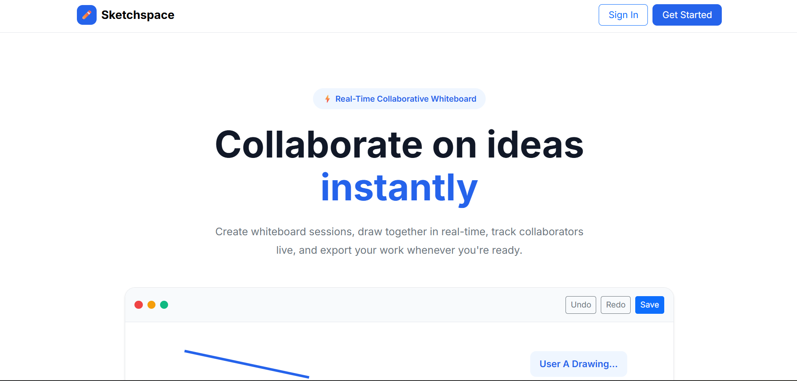
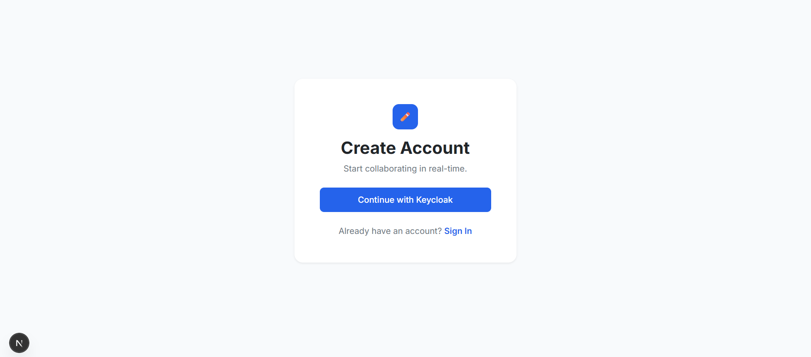
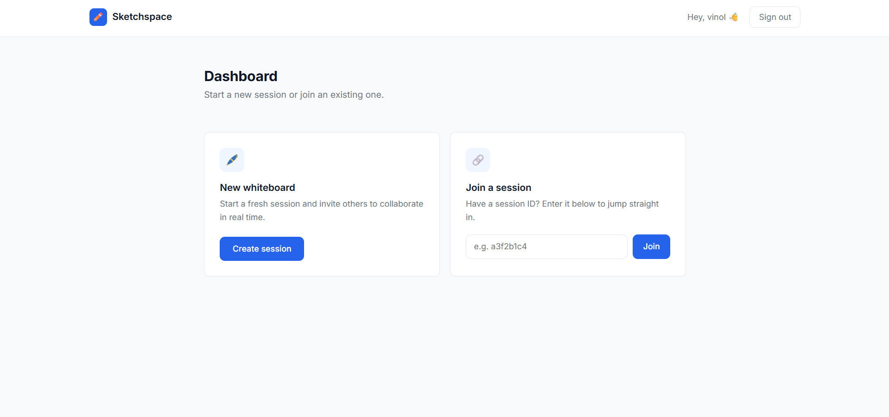
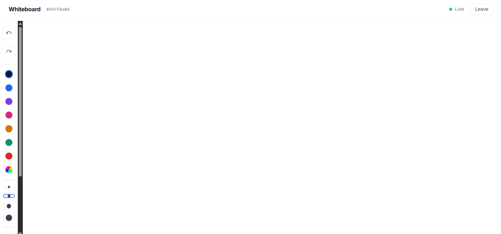
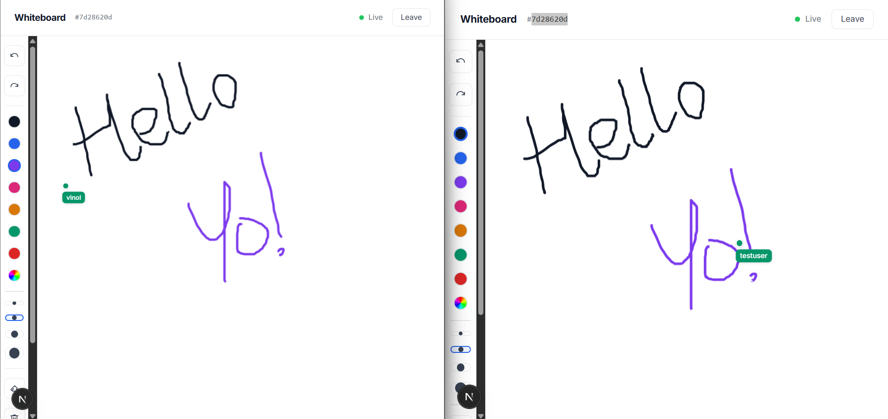
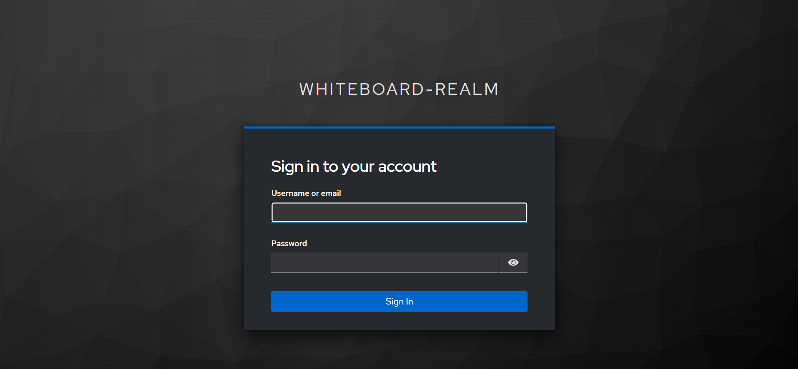

# Sketchspace — Real-Time Collaborative Whiteboard

A real-time collaborative whiteboard application built with Next.js, FastAPI, and Keycloak authentication.

---

## Screenshots

> _Add screenshots here after taking them (see Screenshots section below)_

| Landing                             | Login                           | Dashboard                               |
| ----------------------------------- | ------------------------------- | --------------------------------------- |
|  |  |  |

| Whiteboard                                | Collaboration                                   | Keycloak                              |
| ----------------------------------------- | ----------------------------------------------- | ------------------------------------- |
|  |  |  |

---

## Features

- **Create & Join Sessions** — Generate a unique session ID or join an existing one
- **Freehand Drawing** — Draw with configurable colors and brush sizes
- **Eraser** — Switch between drawing and erasing modes
- **Undo / Redo** — Step through drawing history
- **Clear Canvas** — Reset the board for all connected users
- **Export PNG** — Save the whiteboard as an image
- **Export PDF** — Save the whiteboard as a PDF document
- **Real-Time Stroke Sync** — All drawing actions broadcast instantly via WebSocket
- **Real-Time Cursor Sync** — See other users' cursors moving live
- **Keycloak Authentication** — Only authenticated users can access the whiteboard
- User Registration via Keycloak
- Route Protection for Dashboard and Whiteboard Sessions
- **Responsive Design** — Works on desktop and mobile

---

## Tech Stack

| Layer          | Technology                                       |
| -------------- | ------------------------------------------------ |
| Frontend       | Next.js 16 (App Router), TypeScript, Bootstrap 5 |
| Drawing        | Fabric.js                                        |
| Backend        | FastAPI, Python 3.11                             |
| Real-Time      | WebSockets                                       |
| Auth           | Keycloak 26                                      |
| Infrastructure | Docker, Docker Compose                           |

---

## Architecture

```
Browser
  │
  ├── Next.js Frontend (port 3000)
  │     ├── Keycloak-js — handles login/logout/token
  │     └── WebSocket client — sends/receives strokes and cursors
  │
  ├── FastAPI Backend (port 8000)
  │     ├── WebSocket manager — manages rooms and connections
  │     └── auth.py — JWT verification via Keycloak JWKS endpoint
  │
  └── Keycloak (port 8080)
        └── whiteboard-realm — manages users and tokens
```

---

## Prerequisites

- [Docker Desktop](https://www.docker.com/products/docker-desktop/)
- That's it.

---

## Setup & Running

### 1. Clone the repository

```bash
git clone <your-repo-url>
cd whiteboard-app
```

### 2. Start all services

```bash
docker compose up --build
```

This starts:

- Keycloak on `http://localhost:8080`
- FastAPI backend on `http://localhost:8000`
- Next.js frontend on `http://localhost:3000`

First run takes 3–5 minutes to build.

### 3. Open the Application

After Docker Compose starts:

Frontend:
http://localhost:3000

Keycloak Admin Console:
http://localhost:8080

Admin Credentials:

Username: admin

Password: admin

The whiteboard-realm and whiteboard-client are imported automatically during startup.

No manual Keycloak configuration is required.

### 4. Open the app

Go to `http://localhost:3000`

---

## Usage

1. **Login** — Click Continue on the login page, authenticate via Keycloak
2. **Create a session** — Click "Create session" on the dashboard
3. **Share the session ID** — Give the ID to collaborators
4. **Collaborate** — Draw together in real time, see each other's cursors
5. **Export** — Use the toolbar to export as PNG or PDF

---

## Stopping the app

```bash
docker compose down
```

---

## Project Structure

```
whiteboard-app/
├── docker-compose.yml
├── backend/
│   ├── Dockerfile
│   ├── requirements.txt
│   └── app/
│       ├── main.py              # FastAPI app, WebSocket endpoint
│       ├── auth.py              # Keycloak JWT verification
│       ├── websocket_manager.py # Connection & broadcast management
│       └── rooms.py             # Room state management
└── frontend/
    ├── Dockerfile
    ├── package.json
    └── src/
        ├── app/                 # Next.js App Router pages
        ├── components/          # BoardClient, Toolbar, Canvas, Cursors
        ├── hooks/               # useWebSocket
        └── services/            # keycloak.ts
```
